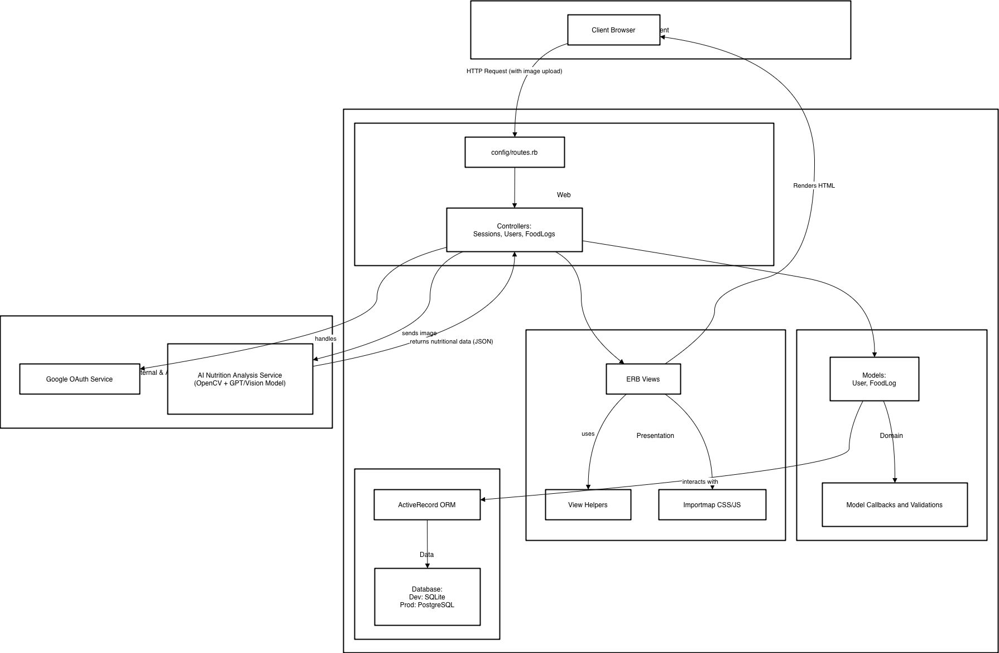
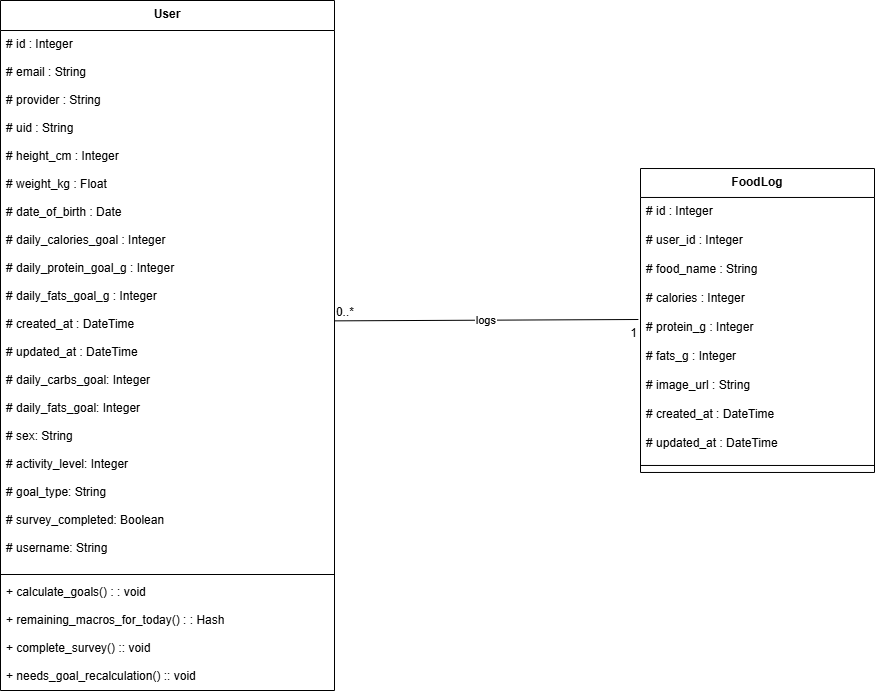

## Diet Tracker Platform

 Diet Tracker is a Ruby on Rails web application that allows users to log meals, calculate personalized macro targets, and stay accountable across devices. It supports Google OAuth sign-in, onboarding surveys that tailor goals, AI-powered photo analysis for food entries, and an accessible dashboard that works even when JavaScript is disabled.

It’s fully tested with RSpec and Cucumber, styled with Rubocop, and includes GitHub Actions CI/CD that deploys automatically to Heroku after merging to main.

---

## Useful URLs

| Resource | Link / Notes |
| --- | --- |
| Heroku Dashboard | https://diet-tracker-7b90cf3013e1.herokuapp.com/dashboard |
| GitHub Actions | https://github.com/tamu-edu-students/CSCE606-Group2-Project2/actions |
| GitHub Projects Dashboard | https://github.com/orgs/tamu-edu-students/projects/165 |
| Burn up chart | https://github.com/orgs/tamu-edu-students/projects/165/insights?period=1M  |
| Slack Group (Scrum) | https://csce606group2.slack.com/ |
| Daily Scrum | 10PM–10:30PM on Zoom (Slack workflow posts reminder with meeting link) |

---

## Features

- Google OAuth sign-in via OmniAuth (supports test mode for automated suites; requires GOOGLE_CLIENT_ID / GOOGLE_CLIENT_SECRET or test mode; set DEFAULT_HOST for production callbacks)
- Guided onboarding survey that computes personalized calorie and macronutrient goals (supports metric & imperial inputs)
- Create, edit, and delete food logs with optional photo uploads (Active Storage)
- AI-powered photo analysis via OpenAI Vision when macro fields are blank (requires OPENAI_API_KEY; calls have a short timeout and fall back to manual entry on failure)
- Dashboard summarizing today’s remaining calories and macro balance, plus recent meals
- Grouped food log history (entries grouped by date) and sortable history columns (date, calories, protein, fats, carbs; asc/desc)
- Full server-side flows (progressive enhancement) — app works without JavaScript enabled
- DB-backed background processing using SolidQueue for async tasks (requires SolidQueue migrations + a worker or enable in Puma)
- RSpec + Cucumber test suites with merged coverage via SimpleCov
- Linting & security checks (RuboCop, Brakeman, importmap audit) enforced in CI
- CI/CD pipeline that can deploy to Heroku automatically (requires Heroku secrets in GitHub; workflow must use full checkout and migrations are only run automatically if you add a post-deploy migration step)

---

## Tech Stack

| Category | Technology |
| --- | --- |
| Framework | Ruby on Rails 8.1.1 |
| Language | Ruby 3.4.5 (see `.ruby-version`) |
| Database | SQLite (Dev/Test), PostgreSQL (Heroku) |
| Authentication | Google OAuth via OmniAuth (`omniauth-google-oauth2`) |
| Testing | RSpec, Cucumber, SimpleCov |
| Linting | RuboCop |
| CI/CD | GitHub Actions (`.github/workflows/ci.yml`) |
| File Storage | Active Storage (local disk in dev/test) |
| AI Integration | OpenAI Vision via `ruby-openai` |
| Deployment | Heroku |
| Sprint Planning / Story Board | GitHub Projects |

---

## Getting Started — From Zero to Deployed

### 1️⃣ Prerequisites

Make sure you have the following installed:

| Tool | Install Command |
| --- | --- |
| Ruby | `rbenv install 3.4.5` |
| Bundler | `gem install bundler` |
| SQLite3 (for local development) | `sudo apt-get install sqlite3 libsqlite3-dev` (Linux) or `brew install sqlite3` (Mac) |
| Git | `sudo apt install git` |
| Heroku CLI | [Install guide](https://devcenter.heroku.com/articles/heroku-cli) |

### 2️⃣ Clone the Repository

```bash
git clone https://github.com/tamu-edu-students/CSCE606-Group2-Project2.git
cd CSCE606-Group2-Project2
```

### 3️⃣ Install Dependencies

```bash
bundle install
```

### 4️⃣ Setup the Database

```bash
# Create, migrate, and prepare test DB
rails db:migrate
rails db:prepare

# (Optional) Seed with sample data (none by default; add entries before running)
rails db:seed
```

### 5️⃣ Run Locally

```bash
rails server
```

Visit: http://localhost:3000  
Sign in using the Google OAuth button; in test mode the app uses OmniAuth's fake provider credentials.

**Seeded Users**

| Email | Password |
| --- | --- |
| Use Google OAuth test account | Handled by provider (no local password) |

### 6️⃣ Run the Test Suite

This project uses both RSpec (for unit testing) and Cucumber (for feature/BDD testing).

```bash
# RSpec (unit & request tests)
bundle exec rspec

# Cucumber (feature tests)
bundle exec cucumber

# View Coverage Report (coverage is generated after test runs)
open coverage/index.html
```

### 7️⃣ Setup Heroku Deployment (CD)

**Step 1: Create a Heroku App**

```bash
heroku login
heroku create <your-app-name>  # in this case 'heroku create diet-tracker'
```

**Step 2: Add PostgreSQL Add-on**

```bash
heroku addons:create heroku-postgresql:mini --app <your-app-name>
# in this case 'heroku addons:create heroku-postgresql:mini --app diet-tracker'
```

Run `git remote` to confirm the new `heroku` remote, and `git remote show heroku` to verify the target URL.

**Step 3: Set GitHub Secrets**

Add the following under GitHub → Settings → Secrets and Variables → Actions:

| Secret | Description |
| --- | --- |
| `HEROKU_API_KEY` | Your Heroku API key (`heroku auth:token`) |
| `HEROKU_APP_NAME` | Your Heroku app name |
| `HEROKU_EMAIL` | Your Heroku account email |
| `GOOGLE_CLIENT_ID` | OAuth client ID used by the Rails app |
| `GOOGLE_CLIENT_SECRET` | OAuth client secret |
| `OPENAI_API_KEY` | API key for vision-based nutrition analysis |

**Step 4: Database Setup and Deployment**

```bash
# Run on first deploy
heroku run bin/rails db:migrate --app diet-tracker
heroku run bin/rails db:seed --app diet-tracker
```

These steps are added as worker processes in the Procfile to avoid manual repetition. Every merge to `main` triggers deployment through `.github/workflows/ci.yml`. Track progress under the repository Actions tab; the deploy job only runs after all checks pass.

**Manual Deployment (if not using GitHub Actions)**

```bash
heroku run bin/rails db:migrate --app diet-tracker
heroku run bin/rails db:seed --app diet-tracker
git push heroku main
heroku open
```

---

## CI/CD Pipeline Summary

| Stage | What it Does |
| --- | --- |
| `scan_ruby` | Runs Brakeman for Rails security issues |
| `scan_js` | Audits JS dependencies |
| `lint` | Runs RuboCop for code style |
| `test` | Runs RSpec + Cucumber (with coverage artifact upload) |
| `deploy` | Deploys to Heroku automatically after merge to main once all tests pass |

---

## Useful Commands

| Task | Command |
| --- | --- |
| Start server | `rails server` |
| Run RSpec tests | `bundle exec rspec` |
| Run single RSpec test | `bundle exec rspec spec/models/user_spec.rb` |
| Run Cucumber tests | `bundle exec cucumber` |
| Run single Cucumber scenario | `bundle exec cucumber features/onboarding.feature` |
| Check test coverage | `open coverage/index.html` |
| Check latest Heroku logs | `heroku logs --tail` |
| Reset local database | `rails db:drop db:create db:migrate` |

---

## Project Diagrams

- **System Diagram:**

   
- **Architecture Diagram:**

   
- **Class Diagram:**

   
- **Database Schema Design (ER):**

   

---

## User Guide — Diet Tracker

Diet Tracker is designed to make nutrition tracking simple, guided, and resilient—with photo analysis, macro dashboards, and onboarding that adapts to each user, all built on Ruby on Rails.

### Getting Started

**Access the App**  
Visit your deployed app once the Heroku pipeline completes (ex: https://diet-tracker-7b90cf3013e1.herokuapp.com)

**Sign Up / Log In**

- Click **Sign in with Google** to authenticate via OAuth.
- In test mode, OmniAuth provides a fake Google profile so developers can log in without external credentials.

### Dashboard Overview

After signing in, the dashboard highlights:

- Today’s remaining calories and macros
- A breakdown of recent meals logged
- Quick links to add a new food entry or review the onboarding survey
- A flash banner if you are over your calorie goal

### Creating and Editing Food Logs

1. Click **Add a food entry** from the dashboard.
2. Provide a food name and either:
   - Enter calories, protein, fats, and carbs manually, or
   - Upload a photo so the AI service can suggest values.
3. Click **Save entry** to save; the log appears grouped by date.
4. To edit, open a food entry, adjust values (or upload a new photo), then click **Save Changes**.

> Tip: Logs are sorted by most recent by default. Use the sort picker to switch between date and macro-based ordering.

### AI Photo Analysis

1. Attach an image while creating or editing a log.
2. Leave macro fields blank to trigger OpenAI Vision.
3. Submit the form and review suggested macros; adjust before saving if needed.
4. If the AI call fails or the key is missing, a friendly error appears and manual values are preserved.

### Managing Your Account

- **Update Goals:** Go to Profile → Update goals, adjust weight/activity/goal, and submit to recalculate macros instantly.

We designed Diet Tracker keeping in mind the user personal data is encrypted and AI suggestions never persist without explicit confirmation.

---

## Goal Adjustment Rules

| Action | User | AI Assistant |
| --- | --- | --- |
| Create log | ✅ | Provides optional suggestions |
| Edit log | ✅ | Offers recalculated estimates |
| Delete log | ✅ | ❌ |
| Recalculate daily goals | ✅ | Not applicable |
| Trigger photo analysis | ✅ | ✅ (requires API key) |

---

## Tips for Best Use

- Keep your onboarding info current so macro targets stay accurate.
- Upload clear, well-lit photos for best AI results.
- Review AI-suggested macros before saving.
- Log meals shortly after eating for precise day totals.
- Store your OpenAI key in GH secrets during development and Heroku config vars in production.

---

## Sample Logins (OmniAuth Test Mode)

If you run in development without real Google credentials, OmniAuth provides:

| Name | Email | Password |
| --- | --- | --- |
| Test User | tester@example.com | Handled by provider |
| Second Tester | second@example.com | Handled by provider |

These accounts exist only in local/test environments and are not persisted unless you save them.

---

## Troubleshooting

| Problem | Likely cause(s) | Suggested fix / verification |
| --- | --- | --- |
| Cannot sign in (Google OAuth) | `GOOGLE_CLIENT_ID` / `GOOGLE_CLIENT_SECRET` missing, `DEFAULT_HOST` / callback URL mismatch, or Google consent not configured | 1. Ensure `GOOGLE_CLIENT_ID`/`GOOGLE_CLIENT_SECRET` are set locally (e.g. `.env`) and in Heroku / GitHub Secrets. 2. Confirm `DEFAULT_HOST` matches production callback and is registered in Google Console. 3. Tail logs while reproducing: `heroku logs --tail -a <app>` and check `/auth/google_oauth2` requests. |
| AI analysis fails or times out | `OPENAI_API_KEY` missing/invalid, network issue, client timeout too short, or response parsing error | 1. Verify `OPENAI_API_KEY` present in env/config. 2. Inspect app logs for HTTP errors / JSON parse errors. 3. Increase client timeout if needed (we use 8s by default). 4. Add defensive parsing: log raw response and fall back to manual entry (app already does this). |
| No coverage report after tests | SimpleCov not required early enough, resultset stale, or separate processes not merged | 1. Require SimpleCov at test startup (spec/simplecov_helper.rb). 2. Delete `coverage/.resultset.json` before running tests to force fresh merge. 3. Run RSpec then Cucumber and open `coverage/index.html`. |
| Heroku deploy fails | Missing Heroku secrets in CI, shallow checkout (fetch-depth), missing add-ons or buildpack mismatch | 1. Confirm GitHub Actions secrets: `HEROKU_API_KEY`, `HEROKU_APP_NAME`. 2. Ensure `actions/checkout` uses `fetch-depth: 0`. 3. Check required add-ons (Postgres, S3) exist: `heroku addons -a <app>`. 4. Tail build logs in Actions and Heroku. |
| Macros don’t update after profile change | Normalizer service not invoked, parameters not passed, or exceptions swallowed | 1. Check logs for exceptions during profile update. 2. Verify `MeasurementParamsNormalizer` receives `measurement_system` and `User#calculate_goals!` runs. 3. Add or run regression tests for profile -> goal recalculation. |
| Local server crashes on photo upload | Native image-processing libs missing (libvips/ImageMagick) or Active Storage misconfigured | 1. Install native deps (macOS: `brew install vips` or `brew install imagemagick`). 2. Ensure `image_processing` and `mini_magick`/`ruby-vips` gems installed. 3. For production, configure Active Storage with an S3-compatible service. |
| Pending migrations / app startup shows PendingMigrationError | Migrations not applied on environment | Run: `rails db:migrate` (dev/test) or on Heroku: `heroku run rails db:migrate -a <app>` then restart dynos. |
| SolidQueue/ActiveJob enqueue errors (`PG::UndefinedTable`) | SolidQueue tables missing or worker not running | 1. Ensure SolidQueue migration ran (add migration `db/migrate/*create_solid_queue_tables.rb` if missing). 2. Run `rails db:migrate`. 3. Start a worker: either run SolidQueue in Puma (`SOLID_QUEUE_IN_PUMA=true`) or provision a worker dyno: `Procfile: worker: bundle exec bin/jobs` and `heroku ps:scale worker=1`. |
| Active Storage / attachments fail in production | No persistent storage configured (Heroku ephemeral filesystem) | Configure S3 (or other cloud storage) and set `config.active_storage.service = :amazon` with credentials in env vars. |
| OpenAI parse / invalid JSON errors | Model returned unexpected text or partial stream, parse logic not robust | 1. Log raw responses and include response headers. 2. Sanitize text before JSON.parse (strip code fences, remove non-JSON prefixes). 3. Consider using structured output (function-calling / JSON schema) if stable schema is required. |

---

## Architecture Decision Records (ADRs)

### ADR 1 – Authentication with Google OAuth

- **Status:** Accepted  
- **Date:** 10-15-2025

**Context**  
We needed a low-friction way for students to authenticate without managing passwords, while aligning with university SSO expectations and project rubric requirements.

**Decision**  
Use OmniAuth with the `google_oauth2` strategy, enabling test mode in non-production environments to keep specs and Cucumber scenarios deterministic.

**Consequences**  
- Advantage: Provides familiar, secure sign-in with minimal UI.  
- Advantage: Test mode keeps automated suites independent of third-party services.  
- Downside: Requires Google credentials or test mode configuration before demos.

### ADR 2 – Macro Goal Calculation Service

- **Status:** Accepted  
- **Date:** 10-18-2025

**Context**  
During onboarding, users supply height, weight, activity level, and goal. The logic must support metric/imperial inputs and recalculations when preferences change.

**Decision**  
Isolate data normalization in `MeasurementParamsNormalizer` and encapsulate calculations inside `User#calculate_goals!` so the same entry point serves onboarding, profile edits, and background recalculations.

**Consequences**  
- Advantage: Reusable service keeps controllers slim and testable.  
- Advantage: Centralizes validation and safe ranges for macros.  
- Advantage: Supports both manual overrides and auto-calculated goals.  
- Downside: Additional callbacks add complexity when debugging goal updates.

### ADR 3 – Vision AI for Macro Suggestions

- **Status:** Accepted  
- **Date:** 10-21-2025

**Context**  
Students requested a fast path to log meals from photos without typing macros. We evaluated client-side OCR vs. server-side AI.

**Decision**  
Integrate OpenAI Vision through `NutritionAnalysis::VisionClient`, generating suggestions only when macro fields are blank and the user provides a photo.

**Consequences**  
- Advantage: Produces context-rich macro estimates with minimal UI changes.  
- Advantage: Fails gracefully when API keys are absent or calls timeout.  
- Downside: Adds latency (~1-2s) and depends on an external paid API.

### ADR 4 – Progressive Enhancement for No-JS Flow

- **Status:** Accepted  
- **Date:** 10-23-2024

**Context**  
Accessibility requirements and the grading rubric mandate full functionality without JavaScript, yet we still want responsive UX for modern browsers.

**Decision**  
Build forms with Rails helpers (`form_with local: true`) and rely on Turbo only for optional enhancements, ensuring every flow (onboarding, logging, dashboards) posts traditional requests.

**Consequences**  
- Advantage: Screen readers and no-JS users get identical flows.  
- Advantage: Server-rendered pages simplify testing and reduce flakes.  
- Downside: Some interactions (sorting) require full-page reloads instead of instant updates.

---

## Postmortem

### Issue 1: OAuth Redirect URI Mismatch

- **Date:** 11-01-2025  
- **Status:** Resolved  
- **Related ADR:** ADR 1 – Authentication with Google OAuth  
- **Affected Areas:** Login flow, onboarding redirect

**Summary**  

During our first Heroku deployment the Google console had not been updated with the production callback URL, causing sign-ins to fail with a 400 error.

**Impact**  

- User Experience: All users saw "Authentication failed" after Google redirected back.  
- System Integrity: No data loss, but sessions were never established so dashboards were inaccessible.  
- Business Impact: High—blocked every login attempt in production.

**Root Cause**  

The OmniAuth initializer relied on default callback URLs, but the Google Cloud project only whitelisted localhost addresses. Heroku's hostname triggered a mismatch.

**Resolution**  

Added the Heroku URL to the OAuth consent screen, updated the initializer to read `ENV["DEFAULT_HOST"]`, and configured `config.action_controller.default_url_options`. Rolled a hotfix deploy after confirming sign-in via smoke tests.

**Implementation Highlights**

- Environment variable `DEFAULT_HOST` documented in `.env.example`.  
- Updated smoke test script to hit `/auth/google_oauth2` on staging before release.  
- Added runbook entry under Debug Pointers for quick verification.

### Issue 2: Nutrition Analysis Timeouts

- **Date:** 10-28-2025  
- **Status:** Resolved  
- **Affected Areas:** Food log creation, AI service integration

**Summary**  

API calls to OpenAI occasionally exceeded 10 seconds, freezing the create/update flow and confusing users with blank pages.

**Impact**  
- User Experience: Food log forms appeared to hang, and users sometimes resubmitted creating duplicates.  
- System Integrity: Background threads piled up, increasing memory usage when timeouts stacked.  
- Business Impact: Medium—manual entry still worked, but the flagship AI feature was unreliable.

**Root Cause**  

We instantiated the OpenAI client per request without setting a timeout, so slow responses blocked Puma workers.

**Resolution**  

Introduced a connection-level timeout, moved client instantiation to a memoized helper, and added rescue logic with a friendly flash alert.

**Implementation Highlights**

- `NutritionAnalysis::VisionClient` now sets `request_timeout: 8` seconds.  
- Controller handles failure states and re-renders with the uploaded image.  
- Cucumber scenario covers the error path to avoid regressions.

### Issue 3: SolidQueue missing migration (PG::UndefinedTable)

- **Date:** 11-03-2025
- **Status:** Resolved
- **Summary:** 

Fixed a production SolidQueue issue by adding and running the missing SolidQueue migration so ActiveJob enqueues no longer fail with `PG::UndefinedTable`.

**Impact** 
- User Experience: The AI image analysis feature failed silently. Users could upload an image, but the nutritional data would never be processed and would never appear on their dashboard.
- System Integrity: The job queue was completely non-functional. The app's error-tracking service was flooded with thousands of PG::UndefinedTable exceptions, making it difficult to spot other production issues.
- Business Impact: High. The core AI feature was broken in production, and all other background tasks were also failing.

**Root Cause**

SolidQueue maintains its own schema definition (in db/queue_schema.rb) for its tables. During the initial production deployment, the standard rails db:migrate command was run, but the separate step to install and migrate SolidQueue's tables was missed. The application code was trying to enqueue jobs by writing to tables like solid_queue_jobs, which did not exist in the production database.

**Resolution**

The `solid_queue:install:migrations` generator was run locally to create a standard migration file. This file, which mirrors the queue_schema.rb content, was then committed to the repository and deployed. Running rails db:migrate on the production server created all the necessary tables for SolidQueue to function. The dynos were then restarted to clear any lingering worker errors.

**Implementation Highlights**

- Added a DB migration mirroring `db/queue_schema.rb` to create SolidQueue's required tables.
- Ran `rails db:migrate` on production and confirmed enqueues succeed; restarted dynos to clear lingering worker errors.


---

## Debug Pointers

| Issue / Area | Tried Solutions | Final Working Fix / Recommendation |
| --- | --- | --- |
| Google OAuth failing in development | Restarted server, cleared cookies | Set `OmniAuth.config.test_mode = true` or export valid `GOOGLE_*` secrets |
| Calories not recalculating after onboarding | Reloaded browser | Clear cached params and ensure `MeasurementParamsNormalizer` receives `measurement_system` |
| AI suggestions too high compared to manual entries | Tweaked goal multipliers | Add guardrails and allow users to edit macros before saving |
| Image uploads breaking specs | Disabled attachment tests | Use `ActiveStorage::Blob.open(tempfile)` helper within specs |
| CI deploy job pushing stale code | Pushed again from local | Ensure `git fetch origin main:main` step remains in workflow before pushing to Heroku |

---

## Debugging Common Issues

| Problem | Likely Cause | Fix |
| --- | --- | --- |
| `bundle install` fails | Ruby version mismatch | `rbenv local 3.4.5 && bundle install` |
| `rails server` won’t start | Missing `GOOGLE_CLIENT_ID`/`SECRET` | Set env vars or enable OmniAuth test mode |
| RSpec tests fail | Database not prepared | `RAILS_ENV=test rails db:prepare` |
| Cucumber hangs on photo scenario | Chromedriver/ImageMagick missing | Install required system deps or skip JS tags |
| Heroku deploy fails | `OPENAI_API_KEY` not set on Heroku | Add config var or disable AI feature via ENV flag |
| “ActiveRecord::PendingMigrationError” when starting server | Local migrations haven’t been applied | `rails db:migrate` |

---

## Summary

Diet Tracker helps you:

- Track calories and macros with AI-assisted workflows
- Personalize nutrition goals through guided onboarding
- Stay accessible across devices—even without JavaScript
- Deploy confidently with automated tests and CI/CD

---

## Team Members

- Cameron Yoffe
- Khussal Pradhan
- Yifei Wang

---

_“Fuel smart decisions with every log.”_
